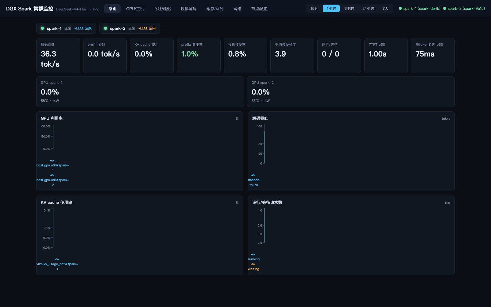

# DGX Spark 集群监控面板

双 DGX Spark（DeepSeek-V4-Flash TP2）实时监控：**每台机器上跑一个 All-in-one 采集代理**（内嵌时序数据库 + systemd 服务），本机通过 **HTTP 拉取**（不是 SSH）汇聚到中控，React 面板绘图。

> 📖 **新手从这里开始**：先看 [GUIDE.md](GUIDE.md)（手把手配置向导：环境检查 → 装 agent → 启动面板）。
> 🧷 **脱敏对照表**：[VARIABLES.md](VARIABLES.md)——本文档不含任何真实 IP/主机名，`.env` 里填你的真实值。
> ⚙️ **配置机制**：[CONFIG.md](CONFIG.md)——两层配置、生命周期、CRUD API。

## 架构

```
┌─────────────┐   HTTP :9100   ┌─────────────┐
│ <HOST_A>    │◄──────────────►│   Mac 中控   │
│ dspark-agent│  snapshot/     │  server :8890│  ┌──────────────┐
│ systemd 服务 │  changes/range│ node:sqlite  │◄─┤ React 面板     │
│ └ SQLite TSDB│               │  REST /api/* │  └──────────────┘
├─────────────┤               └─────────────┘
│ <HOST_B>    │
│ dspark-agent│  ← 同样方式
└─────────────┘
```

- **Agent**（Go，单静态二进制 `.aarch64`）：本机采集 → 写本地 SQLite 时序库 → 暴露 `/snapshot /range /changes`。仅安装时用一次 SSH。
- **中控**（Node 25 或 Bun，零 runtime 依赖）：每 10s 增量拉两台 agent 的 `/changes` 落本地库，提供 `/api/*` + 托管前端。
- **面板**（React + Vite + Recharts）：总览 / GPU主机 / 吞吐延迟 / 投机解码 / 缓存队列 / 网络。

## 配置机制（速览）

```
机器 (agent, /etc/dspark-agent.env):  采集什么/频率/保留期   ← 安装脚本写
         │
         ▼  HTTP :9100
Mac (中控 config_nodes 表):           拉取谁/地址/启停        ← 面板「节点配置」页 CRUD
```

- 节点配置**持久化**在 `data/central.db`；`.env` 仅在首次播种；改配置**不用重启**（≤10s 生效）
- 完整机制与 API 见 [CONFIG.md](CONFIG.md)

## 效果预览

双节点在线状态、解码吞吐/prefill/KV cache/prefix 命中率/投机解码/延迟分位等健康卡，+ GPU 利用率与吞吐实时曲线：



> 📸 全部 6 个页面截图与重新生成脚本见 [PREVIEWS.md](PREVIEWS.md)（「节点配置」页含真实内网地址，刻意不保留截图）。
> ⚠️ 截图来自实际运行环境，含真实机器名/实时数据；公开分发前请用 `docs/screenshots/capture.sh` 在你的环境重新生成。

## 快速开始

**0. 填变量**：打开 [VARIABLES.md](VARIABLES.md) 弄清占位符含义 → `cp .env.example .env` 并替换为你的真实值。

### 1) 构建并安装 agent（一次性 SSH）

```bash
bash deploy/build-agent.sh                                  # 交叉编译 linux/arm64
bash deploy/install-agent.sh <HOST_B>                       # worker
bash deploy/install-agent.sh <HOST_A> --vllm http://127.0.0.1:8888   # head 采 vLLM

# 卸载
ssh <HOST_A> sudo systemctl disable --now dspark-agent
```

安装后：`/usr/local/bin/dspark-agent`，`/etc/dspark-agent.env`，`/var/lib/dspark-agent/metrics.db`（默认保留 7 天）。

### 2) 启动中控 + 面板

```bash
pnpm install
pnpm --filter dashboard build        # 也可 pnpm dev 跑 Vite 热更新
bash scripts/start-dashboard.sh      # 读取 .env 首次播种 → http://127.0.0.1:8890
```

> **配置机制**：`.env` 只在首次启动时播种节点，之后在面板「节点配置」页增删改
> （配置中心，持久化到 SQLite，改完立即生效）。详见 [GUIDE.md](GUIDE.md) 第 5.1 节。

开发模式（热更新，Vite 代理 /api → 8890）：

```bash
pnpm dev:server     # 终端1
pnpm dev:dash       # 终端2 → http://127.0.0.1:5173
```

### 3) 环境自检（随时可跑）

```bash
bash scripts/preflight.sh     # HTTP 自检；加 SSHT=1 再查双机 SSH
```

## 指标清单

### 主机层（每台，5s）
`host.gpu.util/.temp_c/.power_w/.sm_mhz/.present` · `host.cpu.util` · `host.load1/5/15` · `host.mem.used_pct/.used_gb` · `host.disk.used_pct` · `host.net.*.rx_bps/.tx_bps`（含 4 个 fabric 口）· `host.roce.active`（RoCE 链路数）· `host.container.cpu_pct/.mem_mb`（vLLM 容器）

### 服务层（head，5s，采 vLLM /metrics）
- 吞吐：`vllm.decode_tok_s/.prompt_tok_s/.iter_tok_s`（增量速率）
- 延迟分位：`vllm.ttft/itl/e2e/queue 的 _p50/_p90/_p99`（从直方图算）
- 投机解码：`vllm.spec_accept_rate/.spec_accept_len/.spec_pos_0..5_rate`
- 缓存：`vllm.prefix_hit_rate/.prompt_cached_pct/.kv_usage_pct`
- 并发：`vllm.running/.waiting/.preemptions`
- 累计：`vllm.gen_tok_total/.prompt_tok_total/.spec_*_total`

## 存储

- Agent：SQLite `series(name, ts, val)` PK(name,ts) WITHOUT ROWID + `latest` 快照缓存，WAL，7 天保留 + 每小时修剪。
- 中控：同构 `series(node, name, ts, val)`，全量历史镜像。库文件 `data/central.db`（已 gitignore）。

## API（agent `:9100` / 中控 `:8890`）

| 路由 | 说明 |
|---|---|
| `GET /health` | 存活、行数、最近写入 |
| `GET /snapshot` | 每个系列最新值 |
| `GET /series` | 系列清单 |
| `GET /range?name=&from=&to=&step=` | 区间（step>0 时 AVG 降采样） |
| `GET /changes?since=&limit=` | 增量（中控同步用） |

中控 `:8890`：`/api/nodes /api/health /api/snapshot /api/series /api/range` + 前端静态文件。

## 目录

```
GUIDE.md      手把手配置向导（新手入口）
CONFIG.md     配置机制说明（两层配置/生命周期/CRUD API）
VARIABLES.md  占位符对照表（脱敏）
agent/        Go 采集代理（tsdb.go 时序库 · collect.go 采集 · vllm.go 派生产物 · main.go HTTP）
apps/server/  Node 中控（config.ts 配置库 · store.ts 镜像库 · puller.ts 动态拉取 · index.ts API）
apps/dashboard/ React 面板（含「节点配置」页）
 deploy/      build-agent.sh 交叉编译 · install-agent.sh 装 systemd · dspark-agent.service
 scripts/     preflight.sh 环境自检 · start/stop-dashboard.sh
```

## 已知边界

- GB10 的 nvidia-smi 报 `[N/A]` 显存 → `host.gpu.mem_*` 为 0，显存使用看 vLLM 的 `kv_usage_pct` 与 `host.mem.used_pct`。
- 每台 agent 在无 vLLM 节点上跳过服务层采集。
- 中控与面板需要与集群同 LAN。

## 一键打理

```bash
bash scripts/start-dashboard.sh           # 中控+面板（后台）
bash scripts/stop-dashboard.sh            # 停止
```
